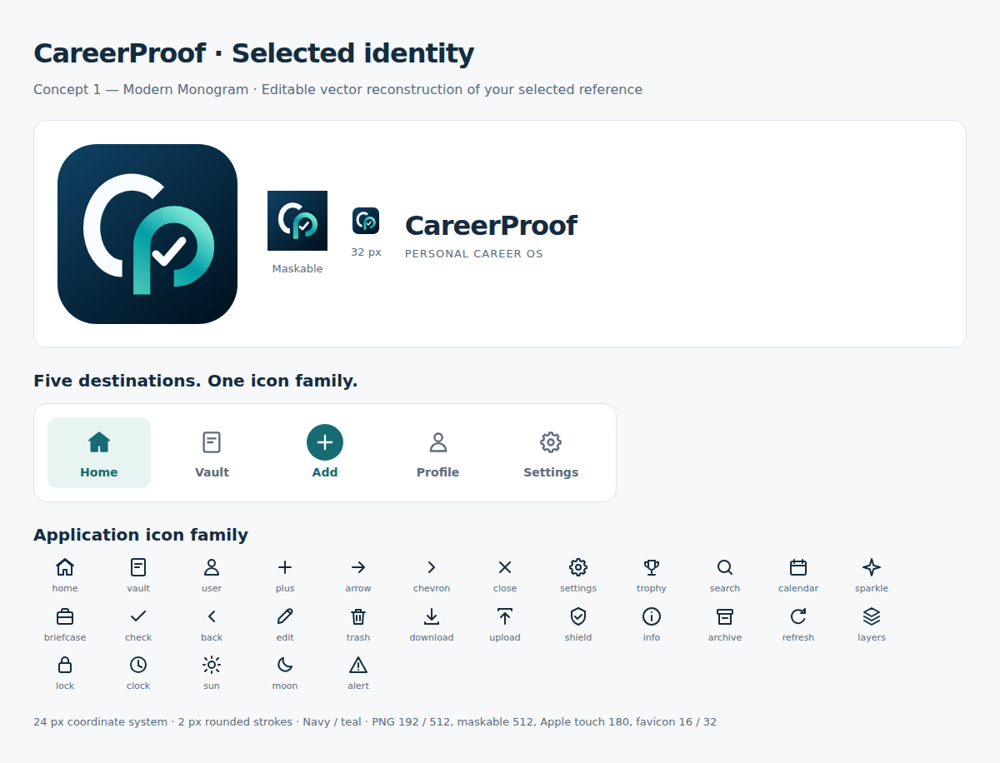

# CP-011A.1 branding selection

On 2026-10-09 the user selected **Concept 1 — Modern Monogram** from their supplied reference and the five navigation icons beneath it: Home, Vault, Add, Profile, Settings. This selection supersedes the prior request to omit a check mark: the selected reference explicitly contains a small check inside the P.

The earlier [proof-mark exploration](branding/concepts.png) and [plain-monogram exploration](branding/monogram-concepts.png) were rejected. They are review history, not application assets. No proposed design was applied before selection.

The selected reference had no editable source available. It is reconstructed as native, editable SVG: open white C, teal P, small white check and navy gradient tile. It follows the chosen composition without embedding the supplied raster sheet or phone mockups.

## Production treatment

| Surface | Asset / behavior |
|---|---|
| Sidebar / phone header | Same icon.svg monogram; sidebar wordmark and compact rail |
| PWA | icon-192.png and icon-512.png, purpose any |
| Maskable PWA | Separate icon-maskable-512.png, opaque square and additional safe padding |
| Apple Home Screen | Opaque apple-touch-icon.png, 180×180, HTML touch link |
| Favicons | SVG plus PNG 16/32 fallbacks |
| Offline / upgrades | Every referenced icon and new dialog module in careerproof-v0.1.1-alpha.2 shell cache |
| Nav / all UI icons | House, document, plus, person and gear; other glyphs share their stroke/grid style |

Selected SVG/PNGs are included in `public/`. The selected sheet and self-contained HTML live in `docs/branding/`; generated by `scripts/brand-review.mjs`.

No new splash screen, destination or product functionality is introduced. iOS may retain the existing Home Screen icon after an application update; first reopen or reload the existing installed app without clearing browser storage. Real-device update behavior remains an acceptance check.

**Removing or reinstalling the iPhone Home Screen PWA may delete its locally stored data. Do not remove the existing installed app solely to refresh its icon without first exporting a backup, verifying that it passes the application's backup validation/preview (cancel before confirming replacement), and storing it securely outside the app.**
