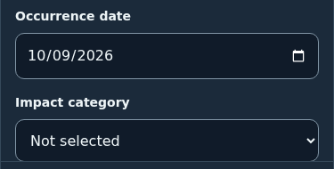
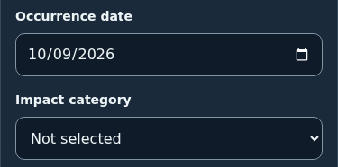
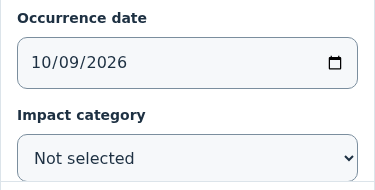
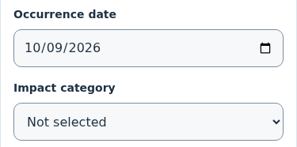
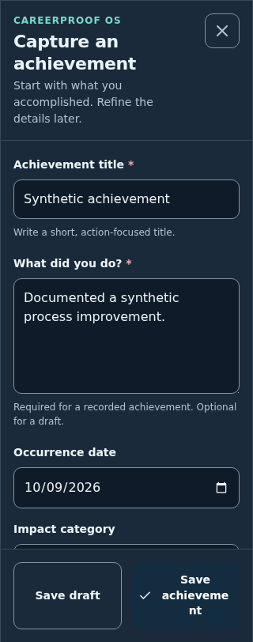
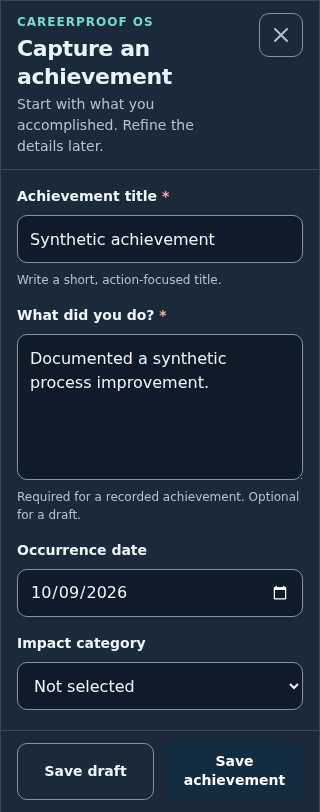
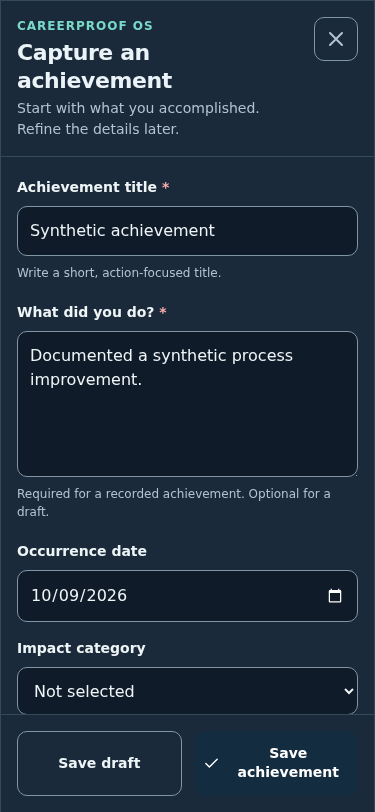
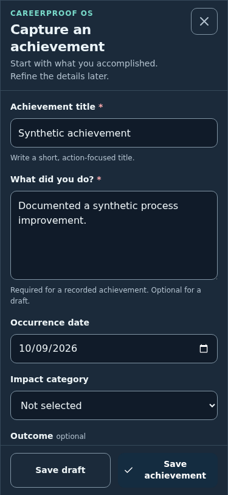

# CP-011A.2 — iOS form and navigation refinement

**Proposed release:** 0.1.1-alpha.3. **Baseline:** main `daf2facc2a4a8c2f81f69c8433ee03fb4ad7fe1d`, merged PR #5 (alpha.2). **Branch:** `fix/cp-011a2-ios-form-nav-density`. User review/merge and physical iPhone verification are required; CP-011B remains paused.

## Diagnosis and correction

The supplied iPhone screenshot shows the native occurrence-date input centered and extending past the other controls' right margin. The first title label has also scrolled above the body, and the footer leaves substantial space below its buttons.

The shared input rule supplied `width:100%` plus padding while retaining native date appearance. `.field` already had `min-width:0`, and `.field-row` used shrinkable `minmax(0,1fr)` tracks. Those parent rules did not prevent iOS's special native-control sizing. [WebKit issue 301648](https://bugs.webkit.org/show_bug.cgi?id=301648) documents iOS-only incorrect width calculations for padded, 100%-width date/time inputs. This is the source diagnosis consistent with the supplied screenshot; physical confirmation of the correction is still pending.

Date/month/week/time/datetime inputs now explicitly reset appearance, keep border-box sizing, constrain their inline size, and left-align WebKit's native value. A 48px height keeps blank dates the same size as populated controls. Inputs/selects share 1px border, theme background, 10px radius, 16px font, 10px vertical/12px horizontal padding and 1.5 line height. There is one border and one real, labelled input: its type, value, native picker, validation and persistence adapter are retained. No custom calendar or hidden overlay is introduced.

Phone dialog opening now focuses the named dialog instead of an editable field. This avoids asking Safari to open its keyboard and pan past the first label. Explicit field focus and viewport resizing scroll only the modal body to retain the field label/context. The background remains inert, with focus trapping/return and direct-backdrop safeguards intact. Desktop initial editable-field focus is retained.

The shared form gap is 16px, label gap 8px and phone body padding 16px. The phone footer uses 12px padding plus its bottom inset once; compact mode uses 8px padding and 88px internally scrollable textareas. Footer buttons retain at least 44px height; labels may wrap at narrow widths, with equal button proportions. Below 360px decorative footer icons are hidden and inline padding becomes 4px to prevent mid-word action-label wrapping.

`--safe-bottom` supplies navigation's bottom padding separately from its content. Only the footer consumes `--dialog-safe-bottom`. A focused editable control with an unzoomed visual viewport more than 150px shorter than layout height is treated as a keyboard candidate and removes the footer's bottom inset. Browser toolbar-sized changes and pinch zoom are excluded. This heuristic and real home-indicator behavior require physical iPhone testing.

## Wealth OS reference and adopted dimensions

Reference: [YabaCodes/wealth-os styles.css](https://github.com/YabaCodes/wealth-os/blob/ffce49beab5ee562300cc55889140926fef48e98/styles.css), commit `ffce49beab5ee562300cc55889140926fef48e98`; `.tabs`, `.tabs-inner`, `.tab`, `.tab-icon`, `.tab-label`, and 700/390px rules were inspected. Its six tabs are not copied: CareerProof retains its five actions, colors and approved vectors.

| Dimension | Wealth OS reference | CareerProof alpha.3 |
|---|---|---|
| Content height | 60px base; 58px below 700px | 60px; 1px divider and bottom safe inset separate |
| Icon size | 21px base; 20px below 700px; 19px through 390px | 19px through 390px; 20px above |
| Icon presentation | 24px height | 24×24px frame, centered in a shared 34px row |
| Label | 10.5px base; 9.5/9px on narrower phones | 10.5px at all phone widths; line height 1.05 |
| Icon/label rhythm | 3px gap | 3px gap after the shared row; common centers and label baseline |
| Add treatment | No direct five-item center-Add equivalent | 34px circle centered on the same 24px frame, no raised item |
| Stroke | Selected glyphs use stronger active emphasis | 1.8px on all phone nav glyphs; original paths retained |
| Touch area | Whole tab | Equal full-width 60px-high buttons, each at least 44px wide at 320px |
| Active state | Foreground/weight emphasis | Teal foreground and selected house fill, transparent item background |

Measured with zero safe inset: nav height decreases **85 → 61px** at all four widths. Capture footer decreases **117.78 → 82.19px at 320px**, **98.19 → 82.19px at 375/390px**, and **81 → 69px at 430px**. A synthetic 34px inset makes the nav 95px while its items remain 60px; it is counted once.

## Before/after screenshots

These are actual Chromium captures of alpha.2 and alpha.3 using identical unsaved synthetic input and an 812px viewport height. Chromium already keeps the old date field within bounds: these comparisons demonstrate presentation/density, **not reproduction or proof of the iOS-specific overflow fix**. The supplied physical iPhone screenshot was reviewed separately. Dates use a fixed synthetic value, not a production record.

| Surface | Alpha.2 | Alpha.3 |
|---|---|---|
| 375px dark date |  |  |
| 375px light date |  |  |
| 375px dark nav |  |  |
| 375px light nav |  |  |
| 320px dark capture/footer |  |  |
| 375px dark capture/footer |  |  |

[Before geometry](ui-evidence/ios-refinement/before-geometry.json) / [after geometry](ui-evidence/ios-refinement/after-geometry.json) cover 320/375/390/430px in both themes. The full generator captures 24 images per version. Representative images are committed; the remaining output is under ignored `test-results/ios-refinement/`.

Regenerate after with `npm run build` then `node scripts/ios-refinement-evidence.mjs after`. To regenerate before, build main's alpha.2 baseline in a separate worktree, then pass its absolute dist path through `CP_TEST_ROOT` to `node scripts/ios-refinement-evidence.mjs before`. The optional third argument chooses the output directory. No production data/origin is accessed. Focused browser tests also attach date/nav captures for each viewport/theme; pixel-perfect cross-platform golden assertions are not used.

## Data and branding scope

IndexedDB remains **schema 2**, complete backups **format 2**, with **legacy format 1** supported. Date precision representation/adapters, IDs, timestamps, revisions, archive behavior, strict validation, 12 MiB limits, atomic recovery and persistent dataset generations are unchanged. No source under `src/data`, dates, validators or taxonomy changed; the only domain-model edit is APP_VERSION. No records are reconstructed, reset, automatically imported or fictionally seeded into production.

The CP monogram, PNGs, favicon, Apple touch icon, maskable assets, manifest and icon paths are byte-for-byte unchanged. Only phone navigation size/stroke/emphasis changes. App/package/lock version and worker cache are alpha.3; the existing compiled dialog module remains in the shell. No new module or runtime dependency is introduced.

M01 Career Profile remains Partial (shared dialog controls refined); M02 Vault remains Partial (capture/edit/date presentation refined); M08 remains Foundation (shared navigation density only). M03/M04 remain Foundation, M05 Deferred, M06/M07 Not started. CP-011B–E workflows have not begun.

## Automated results and limits

Actual local results on 2026-10-09: `npm test` **37/37 Node + 52/52 Chromium passed**, zero skipped; separate `npm run typecheck`, production `npm run build` and `git diff --check` passed. All fixtures are synthetic. Twenty-two new browser cases cover:

- Date/text/select appearance, labels, width/alignment and all horizontal bounds at 320/375/390/430px in both themes.
- Exact navigation height/frame/icon/stroke/label dimensions, equal distribution and aligned centers/baselines, full-button touch targets.
- Initial focus/context, reduced 300/360px visual viewports with offset 40px, synthetic 34px bottom inset, reachable final field/footer, and pinch-zoom exclusion.
- Null/year/month/day edit and reload, preserved IDs/creation times/rich fields, archive/restore and deliberately cleared new drafts.

The retained suite covers all existing screens at seven widths/both themes, modal routing/focus/dirty forms, profile/CRUD, full/legacy/invalid backups, rollback/migration, blocked/unsupported upgrades and stale writes. Offline tests verify alpha.3 styling, exact date editing, all cached assets and alpha.2-cache fixture cleanup while comparing all 12 stored collections before/after and offline reload.

Initial focused runs exposed a narrow-footer wrapping/textarea-fit issue and a test observing viewport state before the animation-frame update. Both were corrected before the full passing run. CI must pass on the PR head; its result is reported in the PR.

Chromium with touch/mobile viewport flags is not physical iPhone Safari or an installed PWA. Native picker appearance/selection, keyboard animation/scroll behavior, VoiceOver, real safe areas, large text, orientation and offline cold-start remain pending. The prior-worker upgrade is a controlled cache fixture. Backup encryption, sync and large-data phone benchmarking remain outside this corrective scope.

## Manual iPhone gate

See **CP-UI201–206** in [ACCEPTANCE_TESTS.md](ACCEPTANCE_TESTS.md). After an approved merge, reopen/reload the existing app online; do not remove it to refresh icons. Removing/reinstalling may delete local data. Before removing an installation solely to refresh an icon, export a backup, verify application validation/preview without confirming replacement, and securely store it outside the app.

Record iPhone model, iOS/Safari version, Safari vs installed mode, theme and orientation with the result. The user must approve and verify this corrective release before CP-011B starts.
