# CP-011A.1 before/after visual review

Synthetic data only. Baseline alpha.1 (main 35e676f), proposed alpha.2. Widths in filenames; both versions use the same fixtures and a 900px viewport height. Pages are full-page images; dialogs are viewport captures. Browser focus rings reflect actual interaction, not decorative borders.

[Audit findings](UI_AUDIT_CP_011A_1.md) · [Test report](UI_REGRESSION_REPORT.md) · [Selected branding](BRANDING_REVIEW.md) · [Machine-readable audit counts](ui-evidence/audit-summary.json)

## Phone Settings

| Before | After |
|---|---|
| 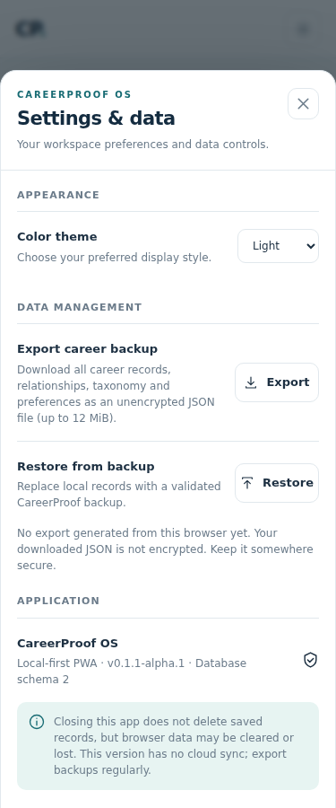 | 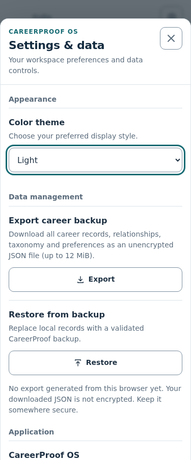 |

## Phone capture

| Before | After |
|---|---|
| 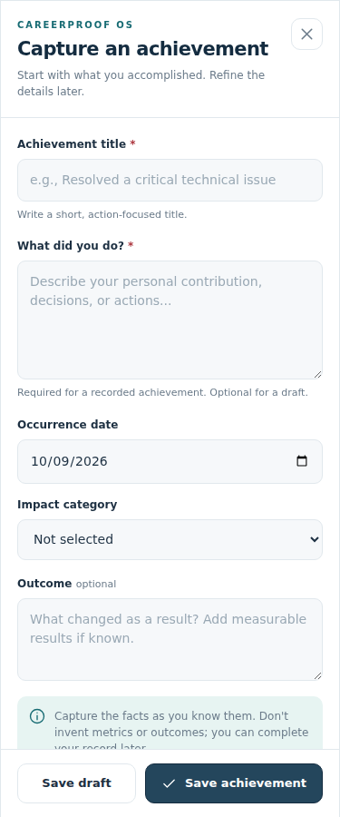 | 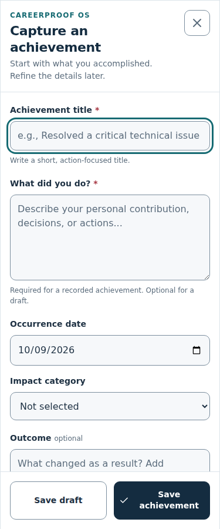 |

## Long phone Profile

| Before | After |
|---|---|
|  | 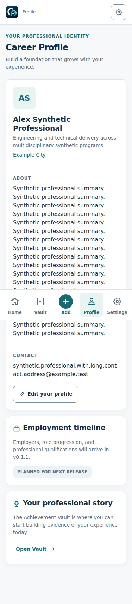 |

## Narrow dark legacy preview

| Before | After |
|---|---|
| 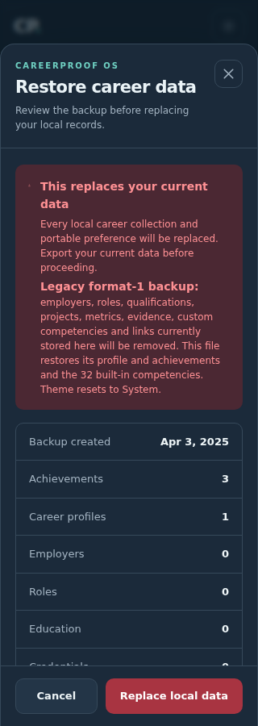 | 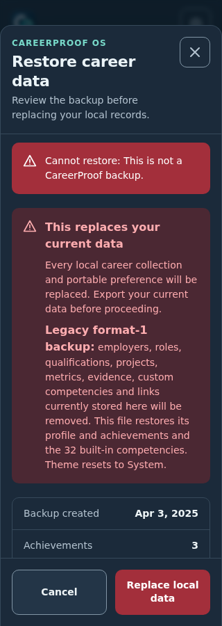 |

## Phone Home and navigation

| Before | After |
|---|---|
| 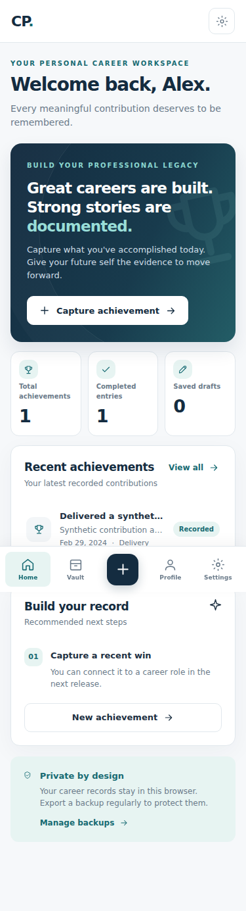 |  |

## Tablet navigation and Vault

| Before | After |
|---|---|
| 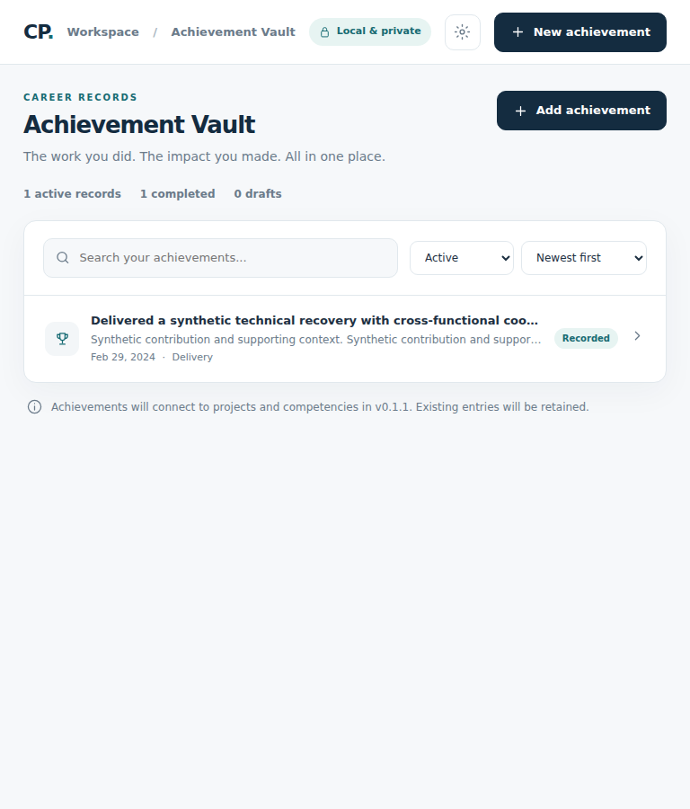 | 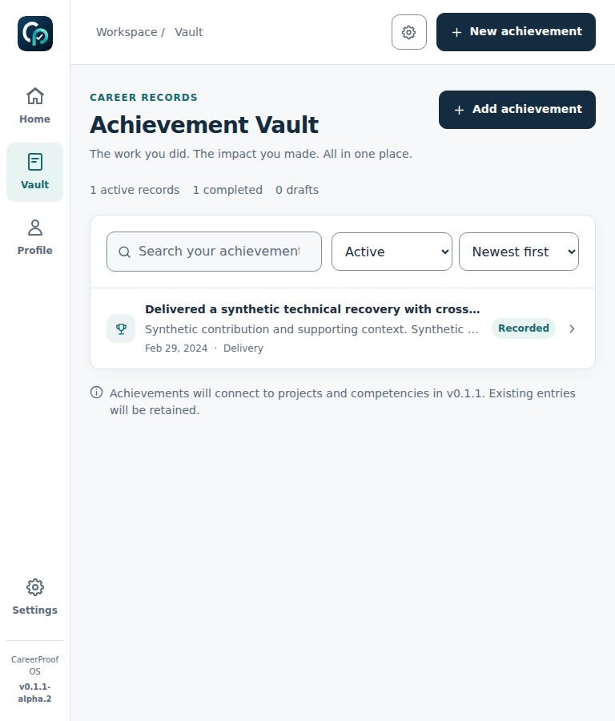 |

## Landscape tablet Home

| Before | After |
|---|---|
| 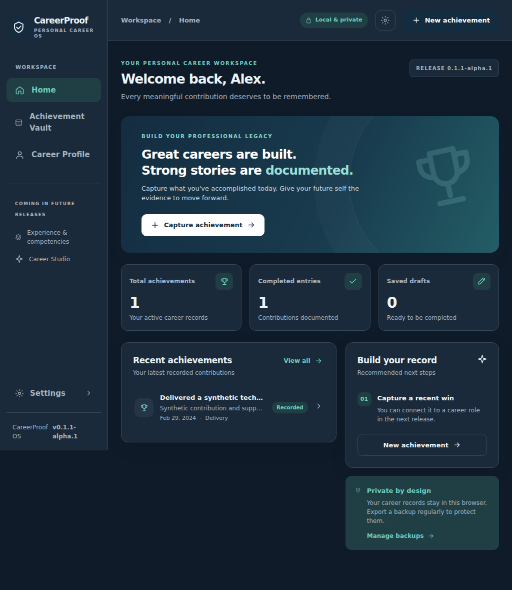 | 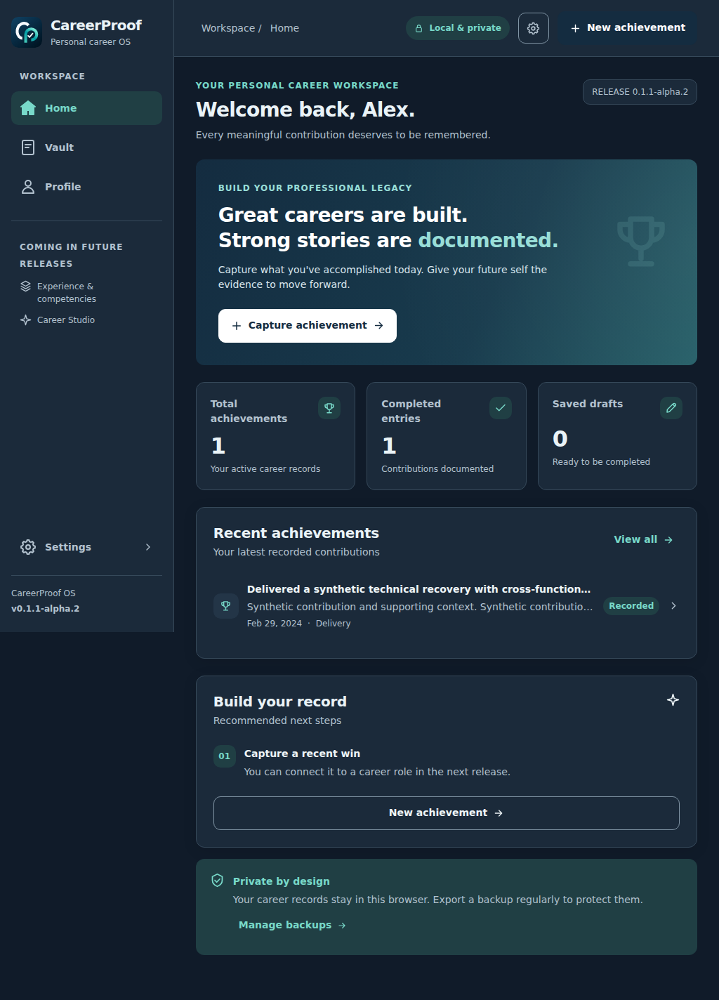 |

## Desktop dark Profile

| Before | After |
|---|---|
| 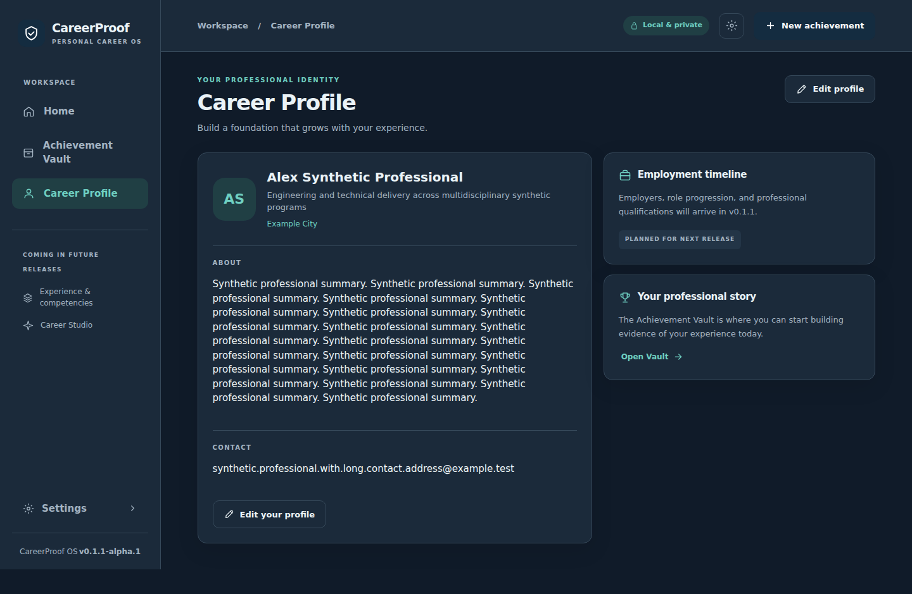 | 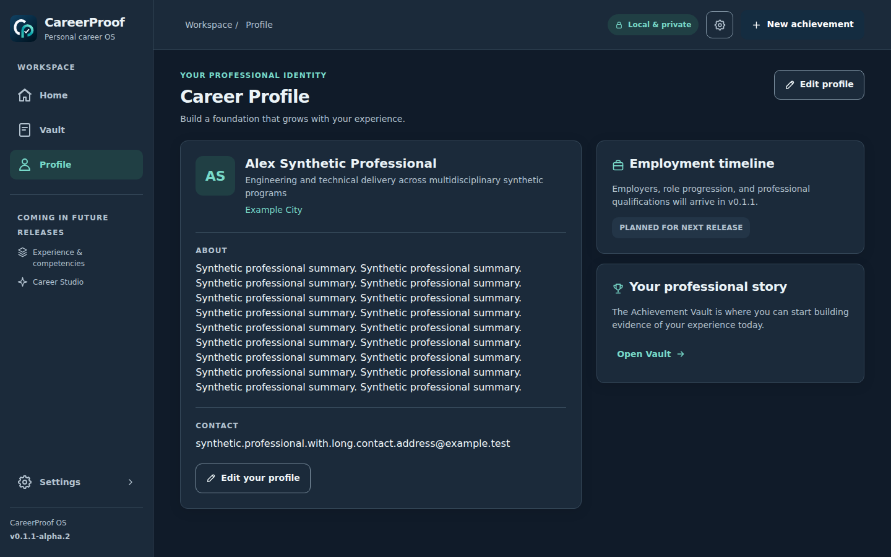 |

Full 252-per-version local audit output is reproducible with scripts/ui-audit.mjs and excluded from git. Baseline tablet navigation was missing, so its screenshot required an explicit hash fixture fallback; the after version uses actual navigation. Native system confirmation appearance, Safari keyboard/safe areas and installed-icon updates still require real devices.
